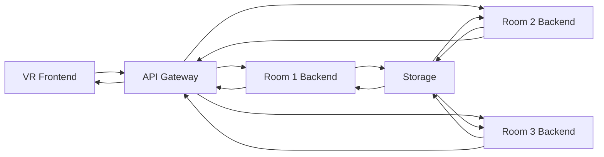

# Architecture Overview

VR4BIZ follows a modular, service-oriented architecture that separates concerns between the frontend VR experience and the backend services. This design enables scalability, maintainability, and future extensibility of the platform.

## System Components

The VR4BIZ system consists of these primary components:

### Frontend VR Application

- Built with Unity/Unreal Engine (specific details determined by implementation)
- Handles rendering, physics, and user interaction within the virtual environment
- Communicates with backend services via RESTful APIs
- Supports various VR headsets and platforms

### Backend Services

Each virtual room has its own dedicated backend service that provides specialized functionality:

- **Room 1 Backend** - Python-based service for image sorting and memory orb generation
- **Future Room Services** - Additional backends will be added as new rooms are developed

### Storage Layer

- Local or cloud-based storage for assets, user data, and generated content
- Configurable to use different storage providers (local filesystem, AWS S3, etc.)

## Communication Flow

1. VR frontend makes API requests to the appropriate room backend
2. Backend processes the request and performs necessary operations
3. Backend returns processed data to the VR frontend
4. VR frontend presents the data in an immersive 3D format

## Deployment Options

VR4BIZ supports multiple deployment configurations:

- **Standalone**: All components run on a single machine for individual or small team use
- **Client-Server**: VR frontend runs on client devices, backend services on a central server
- **Cloud-hosted**: Backend services deployed to cloud providers with VR clients connecting remotely

## Security Considerations

The architecture implements several security measures:

- API authentication and authorization
- Data encryption in transit and at rest
- Input validation and sanitization
- Rate limiting to prevent abuse

## Extensibility

The modular architecture allows for easy extension:

- New virtual rooms can be added without modifying existing components
- Additional services can be integrated through the API gateway
- Different storage providers can be configured without changing application logic 